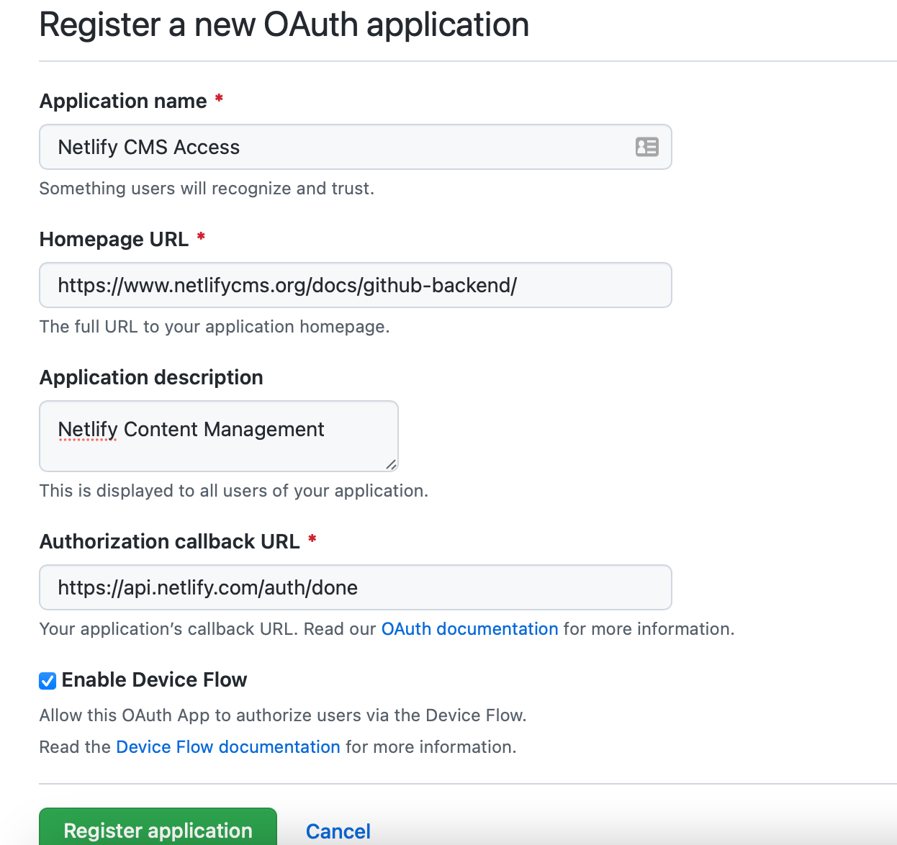

## Netlify CMS Management

These files configure the netlify CMS management.

To manage via netlify first log in to <https://app.netlify.com> and add the website to your list from github.

In config, we are managing access via github, which means we only need to add users on github, not via the Netlify cms. But we do now need to provide an oauth access token from github to log people in. 

You can find details on this process here: <https://docs.netlify.com/visitor-access/oauth-provider-tokens/>

In Github, for the relevant organisation go to 

`Developer Settings` > `OAuth Apps`

Add a new application, for example using details as below.

Then set up a new client ID/secret pair.

Then under Netlify Go to 

`Access Control` > `Install provider`

And add the client ID and client secret from github.
